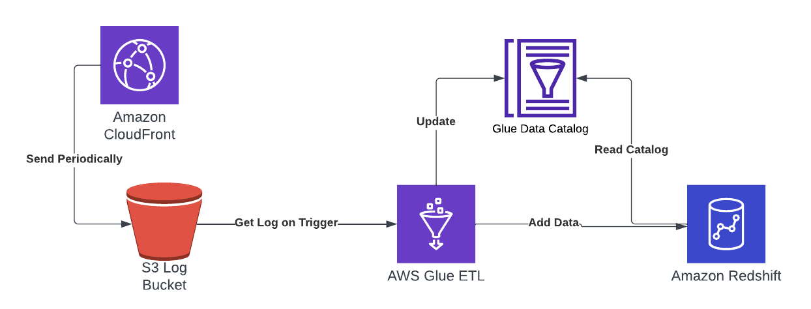

# Answer to Questions

## Question 2

### Possible bottlenecks

- **Network latency and bandwidth:** Reading and writing data directly from S3 can be slower compared to HDFS or a local file system, mainly due to network latency and bandwidth limitations.
This is especially true if your Spark cluster is not in the same region as your S3 storage bucket.
- **Data transfer costs:** AWS charges a fee for data transfers between services, especially when transferring data from S3 to a different region or to the Internet.
- **File size:** CDN logs can be voluminous, resulting in large file sizes. Reading large files increases processing time, especially if not optimised for distributed processing.
- **File format:** If the format of the log files is not suitable for efficient distributed processing (e.g., CSV instead of Parquet or ORC), this can lead to inefficient reads.
- **Partitioning:** Improper data partitioning can lead to processing bias, where some actuators are overloaded while others are underutilised.

### Optimisation

- **EMR with S3 integration:** We use AWS EMR (Elastic MapReduce), which has good integration with S3 and can efficiently read and write data to S3.
- **Data location:** Make sure your Spark cluster is in the same AWS region as your S3 bucket to reduce data transfer time and costs.
- **File Format:** Save logs in a column format such as Parquet or ORC. These formats are optimized for both storage efficiency and search performance on Spark.
- **Division and bucket division:** Share data on S3 according to access patterns. For example, if your analysis occurs frequently on a daily basis, it may be beneficial to break it down by date.
Consider using S3 bucketing to improve performance.
- **Caching:** If certain data is accessed repeatedly, consider caching that data in Spark to avoid redundant reads from S3.
- **Efficient data conversion:** UDFs can be a bottleneck, so use them to a minimum. Use Spark built-in functions whenever possible.
Data shuffling can be a costly operation in terms of time and resources, so manage it carefully.
- **Scaling your cluster:** Appropriately size your Spark cluster based on your workload. 
  - If you're running on a cloud platform, use the auto-scaling feature. 
  - Optimise your Spark configuration. 
  - Adjust Spark configuration to improve performance on Spark (spark.hadoop.fs.s3a.block.size, spark.hadoop.fs.s3a.connection.maximum, spark.sql.files.maxPartitionBytes as needed). (for example enter a value).
- **Concurrency and throughput:** Increase throughput by maximising the number of simultaneous reads/writes to S3 within the performance limits of your network and S3 bucket.
- **Monitoring and logging:** 
  - Configure logging to monitor performance and identify bottlenecks. 
  - Integrate AWS CloudWatch for increased visibility.

## Question 3

### Possible Bottlenecks

1. **Database Connection and Throughput**:
   - Network latency and limited throughput can be significant when connecting to a remote PostgreSQL database. This can slow down data extraction.
   - Concurrent connections to the database might be limited, affecting the ability to parallelize reads efficiently.

2. **I/O Overhead**:
   - Reading large volumes of data from a relational database can be I/O intensive, especially if not optimized with proper indexing or if the database server has limited resources.

3. **Data Serialization and Deserialization**:
   - Transferring data from a relational format to a distributed DataFrame in Spark involves serialization and deserialization, which can be computationally expensive.

4. **JDBC Driver Overhead**:
   - The JDBC driver used for connecting to PostgreSQL may introduce additional overhead, especially if not properly configured or if it's handling large result sets inefficiently.

5. **Resource Contention in the Database**:
   - Heavy read operations might compete with regular transactional queries on the database, potentially impacting its performance.

6. **Data Skew**:
   - Uneven distribution of data (data skew) can lead to inefficient processing where certain Spark executors are overloaded.

### Optimisations

1. **Partitioned Reads**:
   - Use partitioned reads to parallelize data extraction efficiently. Partitioning can be based on a column, such as a timestamp or an ID, to ensure balanced data distribution across Spark executors.

2. **Database Indexing**:
   - Ensure that the database tables are properly indexed on the columns used for filtering or joining. This can significantly speed up data extraction.

3. **Efficient Query Design**:
   - Write efficient SQL queries to minimize the data transferred. For example, filtering data at the database level rather than in Spark can reduce the amount of data that needs to be serialized and transferred.

4. **Connection Pooling**:
   - Use connection pooling to manage database connections efficiently. This can help in maintaining a stable number of concurrent connections to the database.

5. **Resource Allocation**:
   - Properly allocate resources (CPU, memory) to the database server to handle the read load, especially during peak ETL operations.

6. **Optimize Spark Configurations**:
   - Fine-tune Spark configurations related to JDBC, such as `fetchsize` and `batchsize`, to optimize the data transfer between PostgreSQL and Spark.

7. **Load Data in Stages**:
   - Consider staging the data in a more Spark-friendly format (like Parquet) in a distributed file system or cloud storage after extraction. This can allow for more efficient processing in subsequent steps.

8. **Off-peak Scheduling**:
   - Schedule ETL jobs during off-peak hours to minimize the impact on the operational workload of the database.

9. **Monitoring and Diagnostics**:
   - Monitor both the database and Spark cluster performance to identify and address any bottlenecks. Tools like pgAdmin for PostgreSQL and Spark UI can be helpful.

10. **Incremental Loads**:
    - If applicable, use incremental loads (processing only new or changed data) instead of full data dumps to reduce the volume of data processed in each run.

## Question 4

### 1. **COPY Command from Amazon S3**

The COPY command is used to load data in bulk from Amazon S3 into Redshift.

- **Advantages**:
  - **High Performance**: Optimized for loading large volumes of data quickly and efficiently.
  - **Parallel Processing**: Loads data in parallel from multiple files, speeding up the data transfer.
  - **Compression and File Formats**: Supports various file formats and compression methods, reducing data transfer time and storage.
  
- **Trade-offs**:
  - **Pre-Staging Required**: Data needs to be in S3, which means an additional step of uploading data to S3 is required.
  - **Less Suitable for Small Updates**: Not ideal for small, frequent updates or individual record inserts.

### 2. **SQL INSERT Command**

The INSERT command is used for adding records directly to a table in Redshift.

- **Advantages**:
  - **Simplicity**: Straightforward for inserting small amounts of data.
  - **Real-time Inserts**: Suitable for real-time data insertion use cases.

- **Trade-offs**:
  - **Performance**: Much slower compared to bulk loading methods, especially for large datasets.
  - **Resource Intensive**: Can be more resource-intensive and may impact the performance of other queries.

### 3. **AWS Data Pipeline**

AWS Data Pipeline is a web service to process and move data between different AWS services.

- **Advantages**:
  - **Automation**: Automates the movement and transformation of data.
  - **Versatility**: Can handle complex data processing workflows.

- **Trade-offs**:
  - **Complexity**: More complex to set up compared to direct insert methods.
  - **Cost**: Incurs additional costs based on the resources used.

### 4. **AWS Glue**

AWS Glue is a fully managed ETL service that can be used to prepare and load data into Redshift.

- **Advantages**:
  - **Serverless**: No infrastructure to manage.
  - **Integration**: Easily integrates with other AWS services, including S3 and Redshift.

- **Trade-offs**:
  - **Cost**: Can be more expensive for large-scale data processing jobs.
  - **Learning Curve**: Requires understanding of AWS Glue and ETL jobs.

### 5. **Redshift Data API**

The Redshift Data API allows you to run SQL commands on your Redshift cluster asynchronously and retrieve results.

- **Advantages**:
  - **Simplicity**: Easy to integrate with applications and supports asynchronous operations.
  - **Scalability**: Suitable for applications that need to scale requests.

- **Trade-offs**:
  - **Latency**: Not ideal for use cases that require immediate response times.
  - **Complexity for Large Loads**: Not optimized for large bulk data loads.

## Question 5

## Question 6

### Sort Keys

- **Timestamp-Based Sort Key:** If queries frequently involve filtering or sorting based on time (like EdgeStartTimestamp), then the timestamp column is a good candidate for a sort key. This arrangement speeds up queries that scan data over specific time ranges.
- **Compound Sort Key with Game and Mod IDs:** If queries often involve specific game or mod IDs, consider a compound sort key consisting of gameid and modid. This is beneficial if you frequently filter or join on these columns.

#### Merits

- **Efficient Data Scans:** Sorting data in a way that aligns with common query patterns can significantly reduce the amount of data scanned during query execution, leading to faster query performance.
- **Improved Join Performance:** If joins are commonly performed on the sorted columns, this can also speed up these operations.

### Distribution Keys

- **Even Distribution with Game ID:** If `gameid` is a commonly used column in joins and has a high cardinality (many unique values), using it as a distribution key can help achieve an even distribution of data across nodes.
- **Key-Based Distribution on Mod ID:** If `modid` is frequently joined with other tables, consider using it as a distribution key. This ensures that all data for a particular mod is located on the same node, making joins more efficient.

#### Merits:

- **Balanced Data Distribution:** A well-chosen distribution key helps in evenly distributing data across all nodes, reducing data skew and improving parallel processing.
- **Reduced Data Movement for Joins:** When join operations are performed on the distribution key, it minimizes the need for data shuffling across nodes, which is a costly operation in terms of performance.

### Considerations When Choosing Keys

- **Query Patterns:** Analyse the most common and resource-intensive queries to guide the choice of sort and distribution keys.
- **Data Skew:** Monitor for data skew. If a distribution key leads to uneven data distribution, it can degrade performance.
- **Updates and Inserts:** If the table experiences frequent updates or inserts, consider how these operations will impact the choice of sort and distribution keys, as they can lead to data fragmentation.
